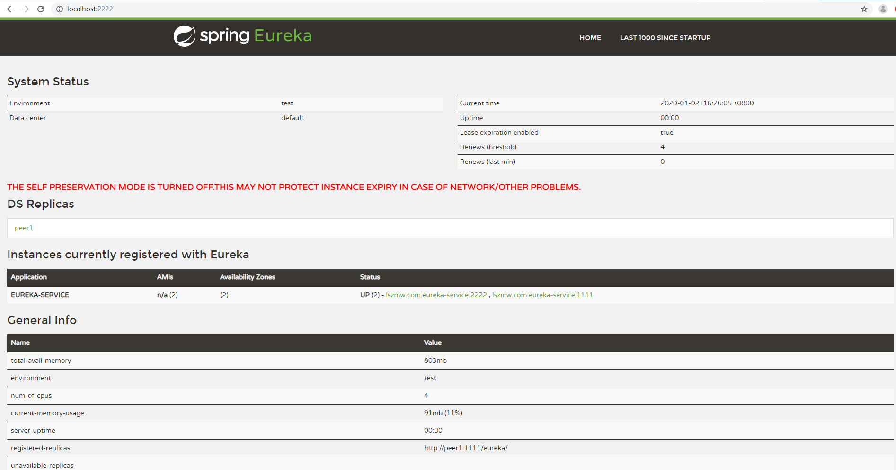

## eureka服务注册中心

### 介绍

    注册中心主要提供注册与发现功能。
    
    Spring Cloud Eureka是Spring Cloud Netfix(核心组件)中的一部分，
    主要负责微服务框架的服务治理功能。注册中心主要提供注册与发现功能，
    服务提供者提供服务，服务消费者消费服务。其具有Spring Boot风格的自动化配置。

相关配置详情见"Spring Cloud Eureka配置详解"。

### 版本说明

    1.Spring Boot 2.1.10
    2.Spring Cloud Finchley.RELEASE
    3.JDK 1.8
    4.MAVEN 3.3.9
    
### 1.peer1与peer2为域名，在本地测试加

hosts文件： 加入以下
    
    127.0.0.1  peer1
    127.0.0.1  peer2
    
### 2.主要说明

**2.1** 启动类加@EnableEurekaServer注解

**2.2** pom.xml引入
	
	<!--euraka 2.0注册中心-->
	<dependency>
	    <groupId>org.springframework.cloud</groupId>
	    <artifactId>spring-cloud-starter-netflix-eureka-server</artifactId>
	</dependency>  

### 3.高可用注册中心（peer1,peer2互相为对方注册中心）

**3.1** application-peer1.properties

	# 服务名称
    spring.application.name=eureka-service
    # 端口
    server.port= 1111
    
    # ip  注册中心ip地址=主机名称
    eureka.instance.hostname=peer1
    
    # 指示此实例是否应将其信息注册到eureka服务器以供其他服务发现，默认为false。
    # eureka.client.register-with-eureka=true
    # 客户端是否获取eureka服务器注册表上的注册信息，默认为true
    # eureka.client.fetch-registry=true
    
    # 将注册中心peer1注册给peer2
    eureka.client.serviceUrl.defaultZone=http://peer2:2222/eureka/
    
    # 关闭保护机制
    eureka.server.enable-self-preservation=false
    #剔除失效服务间隔
    eureka.server.eviction-interval-timer-in-ms=2000

**3.2** application-peer2.properties

	# 服务名称
    spring.application.name=eureka-service
    #端口
    server.port= 2222
    
    #ip 注册中心ip地址=主机名称
    eureka.instance.hostname=peer2
    
    # 指示此实例是否应将其信息注册到eureka服务器以供其他服务发现，默认为false。
    # eureka.client.register-with-eureka=true
    # 客户端是否获取eureka服务器注册表上的注册信息，默认为true
    # eureka.client.fetch-registry=true
    # 将注册中心peer2注册给peer1
    eureka.client.serviceUrl.defaultZone=http://peer1:1111/eureka/
    
    # 关闭保护机制
    eureka.server.enable-self-preservation=false
    #剔除失效服务间隔
    eureka.server.eviction-interval-timer-in-ms=2000

### 4.打包jar，启动peer1,peer2注册中心到注册中心集群

	打包命令：mvn clean package
	1.java -jar eureka-server-1.0.0-SNAPSHOT.jar  --spring.profiles.active=peer1
	2.java -jar eureka-server-1.0.0-SNAPSHOT.jar  --spring.profiles.active=peer2

效果如图：	

